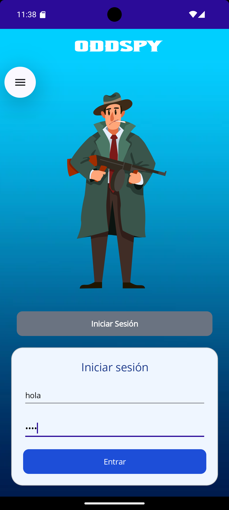
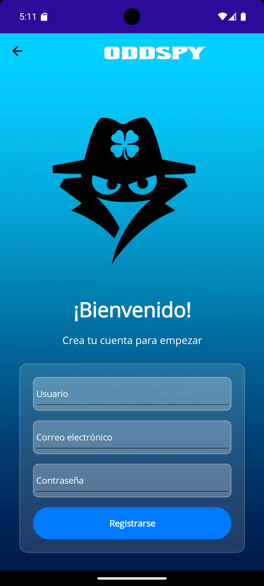
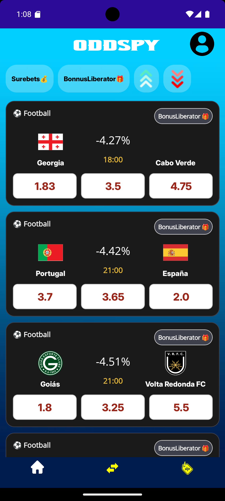
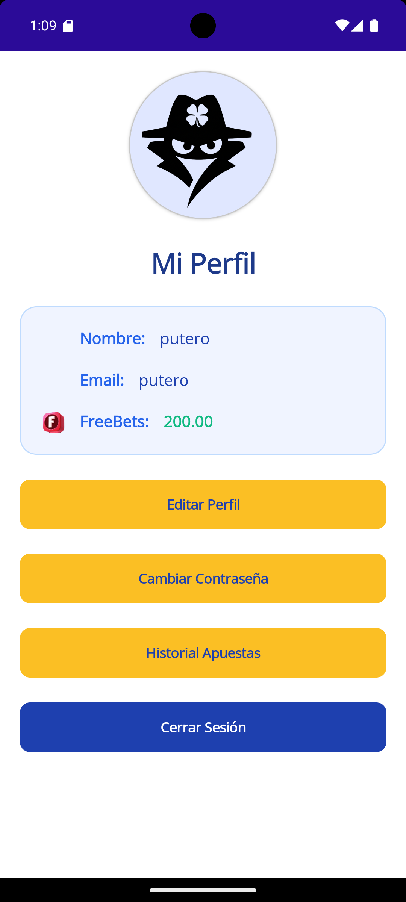
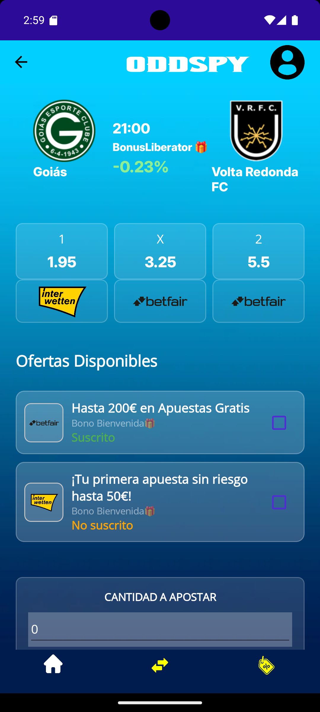
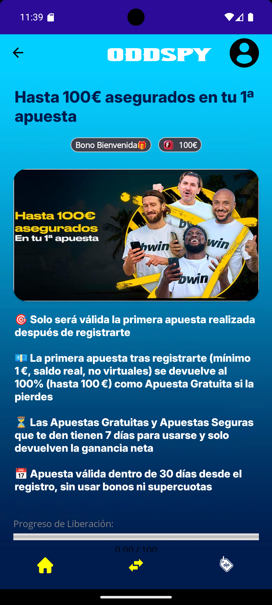

# 🧠 Oddspy - Apuestas sin riesgo con Surebets y Bonus Liberators

Oddspy es una aplicación multiplataforma diseñada para detectar oportunidades seguras en el mundo de las apuestas deportivas mediante el análisis automático de cuotas entre diferentes casas de apuestas. Utiliza estrategias como **Surebets** y **Bonus Liberators** para maximizar las ganancias del usuario minimizando el riesgo.

---

## 📱 Características Principales

- 🔍 **Detección automática de Surebets** entre múltiples casas de apuestas.
- 🎁 **Gestión y aprovechamiento de bonos de bienvenida** (Bonus Liberators).
- 🧮 **Calculadora automática de apuestas** para distribuir el capital óptimamente.
- 🌐 **Interfaz multiplataforma** creada con .NET MAUI.
- 🧪 Sistema de pruebas, automatización y despliegue completo en servidor propio.
- 🔐 API REST desarrollada con .NET + Entity Framework.
- 🧵 Comunicación en tiempo real mediante WebSockets.

---

## 🚀 Tecnologías Usadas

| Tecnología              | Uso Principal                        |
|------------------------|--------------------------------------|
| `Cyandroemu + BlissOS` | Webscraping en apps Android          |
| `Python + Pandas`      | Limpieza y envío de datos            |
| `WebSocket + asyncio`  | Comunicación en tiempo real          |
| `.NET MAUI`            | Interfaz gráfica multiplataforma     |
| `MySQL`                | Almacenamiento de usuarios y datos   |
| `Nginx + Certbot`      | Seguridad y despliegue SSL           |

---

## 🧰 Arquitectura del Proyecto

```txt
Emuladores Android (BlissOS + Cyandroemu)
        ↓
   Extracción y limpieza de datos (Python + Pandas)
        ↓
   Envío de datos (WebSocket)
        ↓
Procesamiento y estandarización (Python)
        ↓
        API REST (.NET + EF)
        ↓
       Aplicación Cliente (MAUI)
```

---

## 🖥️ Instalación y Despliegue

### Requisitos del Servidor

- Ubuntu 22.04
- 32GB RAM, 2 CPUs Xeon, 1TB SSD, GPU GTX 1060
- Dominio configurado 

### Servicios Automatizados

- Inicio automático de máquinas virtuales con VirtualBox
- Ejecución de scripts de scrapping
- Lanzamiento de WebSocket y API
- Configuración de certificados SSL vía Certbot

---

## 🧪 Pruebas

- Todos los endpoints de la API han sido verificados con Postman.
- La interfaz se ha diseñado y probado a mano con XAML.
- Se han simulado escenarios de apuestas reales para asegurar el cálculo correcto de beneficios.

---

## 👨‍🏫 Manual de Usuario

1. **Inicio de sesión / Registro**
2. Accede a:
   - 🔹 *Surebets*: Oportunidades garantizadas
   - 🔹 *Comparador de Cuotas*: Apuesta con mejor beneficio
   - 🔹 *Ofertas*: Bonos disponibles con seguimiento del progreso
   - 🔹 *Perfil*: Edita tu cuenta y revisa historial

---

## ❓ Preguntas Frecuentes

- ¿Hace apuestas automáticas?  
  → No, Oddspy es una herramienta de apoyo, no realiza apuestas por ti.

- ¿Qué deportes incluye?  
  → De momento fútbol, pero se planea incluir tenis y baloncesto.

- ¿Por qué no siempre hay Surebets?  
  → Las oportunidades dependen del momento y del mercado.

---

## 📌 Futuras Mejoras

- Añadir más deportes
- Implementación de IA para validar datos
- Automatización total de apuestas
- Ampliación de casas de apuestas soportadas

---

---

---

## 📷 Capturas de Pantalla

A continuación se muestran algunas pantallas clave de la aplicación Oddspy:

- 🔐 **Inicio de sesión**  
  

- 🆕 **Registro de usuario**  
  

- 🎁 **Ofertas y Bonos**  
  

- 🧠 **Surebets disponibles**  
  

- 👤 **Perfil del usuario**  
  

- 🔎 **Detalle de Surebet**  
  

- 📦 **Detalle de Oferta**  
  


## 📚 Créditos y Bibliografía

- [`Cyandroemu`](https://github.com/hansalemaos/cyandroemu)
- [`Pandas`](https://pandas.pydata.org/)
- [`asyncio`](https://docs.python.org/3/library/asyncio.html)
- [`.NET MAUI`](https://learn.microsoft.com/en-us/dotnet/maui/)
- [Referencias YouTube](https://www.youtube.com/@SameerSaini)

---

## 🧑‍💻 Autor

**Álvaro Prados Mota**  
2º DAM – Trabajo de Fin de Grado  (Nota Obtenida :10/10)
Proyecto 100% funcional con infraestructura propia
